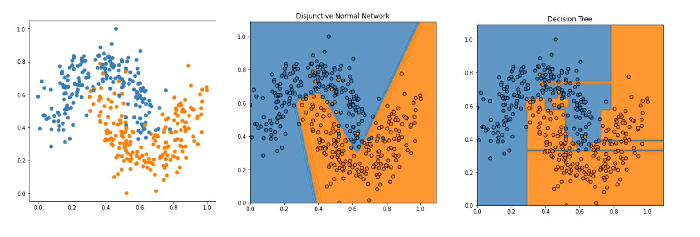
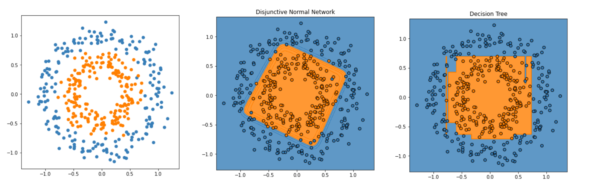
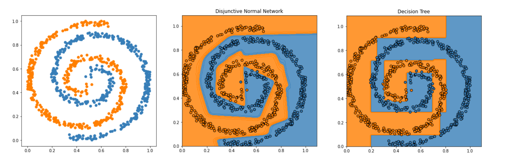

[](https://pypi.python.org/pypi/disjunctive-nn)
[](https://pypi.python.org/pypi/disjunctive-nn/)
[](https://travis-ci.com/tsitsimis/disjunctive-normal-networks.svg?branch=master)


# Disjunctive Normal Networks
A Disjunctive Normal Network (DNN) is a special type of Neural Network used for binary classification. It uses intersected convex polytopes (hyperdimensional polygons) to cover the feature space of positive samples. This allows DNNs to find rules in the form of constraining inequalities in feature space that resemble the rules present in Decision Trees (DTs).

 In 2D it can be seen as multiple convex polygons spread on the plane enclosing all positive samples while leaving negative samples outside. 

Based on paper:
> Mehdi Sajjadi, Mojtaba Seyedhosseini, Tolga Tasdizen (2014). Disjunctive Normal Networks. CoRR, abs/1412.8534.
 [\[pdf\]](https://arxiv.org/pdf/1412.8534.pdf)


## How to use disjunctive-nn
The disjuntive-nn package inherits from scikit-learn classes, and thus drops in neatly next to other sklearn transformers with an identical calling API.

```python
from disjunctive_nn import DisjunctiveNormalNetwork
from sklearn.datasets import make_moons
from sklearn.model_selection import train_test_split
from sklearn.metrics import accuracy_score

X, y = make_moons(n_samples=1000, noise=0.2)
X_train, X_test, y_train, y_test = train_test_split(
    X, y, test_size=0.33, random_state=42)
    
dnn = DisjunctiveNormalNetwork(n_polytopes=2, m=4)
dnn.fit(X_train, y_train)

y_pred = dnn.predict(X_test)
print(accuracy_score(y_test, y_pred))
```

## Installing
PyPI install:
```
pip install disjunctive_nn
```

Alternatively download the package, install requirements, and manually run the installer:
```
wget https://github.com/tsitsimis/disjunctive-normal-networks/archive/master.zip
unzip master.zip
rm master.zip
cd disjunctive-normal-networks-master

pip install -r requirements.txt

python setup.py install
```

## Benefits of Disjunctive Normal Networks
A Disjunctive Normal Network can be seen as an [Oblique Decision Tree](https://www.researchgate.net/publication/260972972_Oblique_Decision_Tree_Learning_Approaches_-_A_Critical_Review) (ODT) learned with backpropagation by minimizing an error function.

Oblique Decision Trees are a generalization of regular Decision Trees with rules that are multivariate resulting in dividing the feature space with boundaries non-parallel to the axes.

This allows DNNs to be much more interpretable (inequality rules on linear combination of features) than a vanilla Neural Network and to be trained with backpropagation.

Overall the main advantages of a DNN over a DT are:
- Uses polytopes instead of hyercubes
- Is trained with backpropagation and can be thus incorporated in any neural network topology as final or intermediate step
- Is less prone to overfitting (although this is a quick result shown by only some simple experiments)

## Theoretical background
### Disjunctive Normal Form
A Decision Tree segments the space in hypercubes by drawing axis-aligned hyperplanes. Each hyperbox encloses the points of one class to form the final decision function of the tree


In the case of binary classification, the interior of the hypercubes enclosing the positive samples can be seen as the subspace where a boolean function becomes True (1) and ouside is False (0).


For the tree of the above picture the associated boolean function (1 for positive class , 0 for class ) is


This boolean function is written in [Disjunctive Normal Form](https://en.wikipedia.org/wiki/Disjunctive_normal_form) meaning that it is a union of intersections or an "OR of ANDs" (in terms of logic gates).

Here is when Disjunctive Normal Networks come into play to represent such boolean functions.

### Half-Spaces and Polytopes
A polytope is the generalization of a polygon and polyhedron in higher dimensions. It can be seen as the intersection of M half-spaces, where a half-space  is defined as the sub-space where it holds  0">


Many such polytopes can be used as covers and optimized to enclose all positive samples in a binary classification problem:


### Decision Function
A half-space can be expressed as a sigmoid function of a linear combination of the feature space
. The intersection of M half-spaces is their product (boolean AND) and forms a polytope 


Finally, the union of N polytopes forms the decision function . To calculate the union we could just add all the  together but in overlapping areas the result would be greater than 1. To tackle this, using the [DeMorgan](https://en.wikipedia.org/wiki/De_Morgan%27s_laws) rule  the sum can be transformed to the product


In the above expression we replace boolean negation of a variable  with  and the boolean AND with a product. 

The function  is then optimized with gradient descent.


## Examples and benchmarking
DNNs were tested on 2D synthetic datasets and compared to Decision Trees which is the closest classifier in terms of complexity and shape of decision function. The point of this experiment is to illustrate the nature of decision boundaries of the 2 classifiers. This should be taken with a grain of salt, as the performance does not necessarily carry over to real datasets.

The accuracy corresponds to the test set after splitting the dataset in train and test set. DNN parameters (N: number of polytopes, M: number of half-spaces per polytope) are set through experimentation.

<table>
    <th>Dataset</th>
    <th>DNN</th>
    <th>DT</th>
    <th>DNN Parameters</th>
    <tr>
        <td>Moons</td>
        <td><b>0.98</b></td>
        <td>0.96</td>
        <td>N=2, M=4</td>
    </tr>
    <tr>
        <td>Circles</td>
        <td><b>0.98</b></td>
        <td>0.96</td>
        <td>N=1, M=4</td>
    </tr>
    <tr>
        <td>Spirals</td>
        <td><b>0.99</b></td>
        <td>0.96</td>
        <td>N=20, M=10</td>
    </tr>
</table>

The below plots show the 2 models' decision function when trained on the whole dataset. The purpose is to show how well the models memorize (overfit) the training set.

### Moons


### Circles


### Spirals



The overall observation is that DNNs provide much **smoother decision boundaries** and overfit less on training data.
