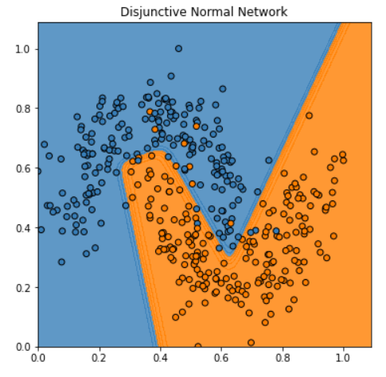
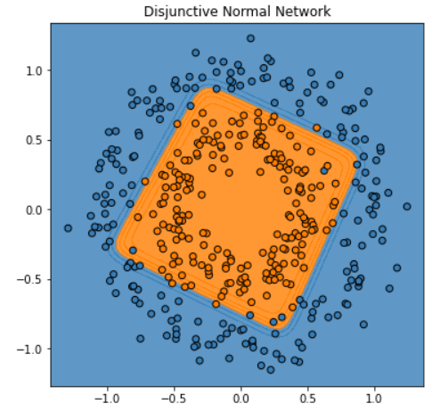
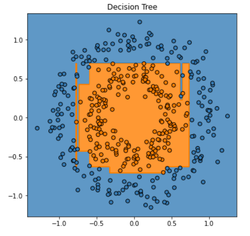
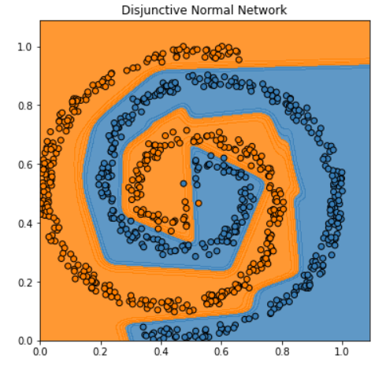
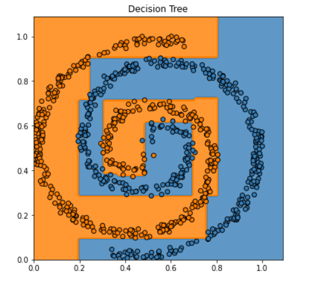

# Disjunctive Normal Networks
Disjunctive Normal Network (DNN) is a special type of Neural Network used for binary classification. It uses intersected convex polytopes that cover the feature space of samples belonging the positive class. In 2D it can be seen as multiple convex polygons spread on the plane enclosing all positive samples while leaving negative samples outside. 

Paper: [https://arxiv.org/pdf/1412.8534.pdf](https://arxiv.org/pdf/1412.8534.pdf)

# Motivation
The purpose of this project is to explore models with the **simplicity** and **interpretability** of Decision Trees (DTs) combined with the differentiability and parameter tuning through backpropagation of Neural Networks.

Representing the decision split function as a sigmoid and forming convex hyper-cubes or polytopes to form the decision function are key to build a model with tree-like characteristics.

A search in the literature revealed that these concepts were present in multiple previous works, the most similar being the Disjunctive Normal Networks paper.

# Model
A Decision Tree segments the space in hypercubes by drawing axis-aligned lines in the feature space. These hyperboxes enclose the points to form the decision function of the tree

The interior of the hypercubes enclosing the positive samples can be seen as the sub-space where a boolean function becomes True (1) and ouside is False (0).

For the tree of the top picture the associated boolean function (1 for positive class , 0 for class ) is

This boolean function is written in [Disjunctive normal form](https://en.wikipedia.org/wiki/Disjunctive_normal_form) meaning that it is a union of intersections or an "OR of ANDs" (in terms of logic gates).

Here is when Disjunctive Normal Networks come into play to represent such boolean functions.

### Half-Spaces and Polytopes
A polytope is the generalization of a polygon and polyhedron in higher dimensions. It can be seen as the intersection of M half-spaces, where a half-space  is defined as the sub-space where it holds  0">

Many such polytopes can be used as covers and optimized to enclose all positive samples in a binary classification problem:

### Training
DNNs define such polytopes and optimize their position and form with backpropagation

A half-space can be expressed as a sigmoid function of a linear combination of the feature space

The intersection of M half-spaces is their product (boolean AND) and form a polytope 

Finally, the union of N polytopes forms the final decision function . To calculate the union we could just add all the  together but in overlapping areas the result would be greater than 1. To tackle this, using the DeMorgan rule  the sum can be transformed to the product

In the above expression we replace boolean negation of a variable  with  and the boolean AND with a product. 

The function  is then optimized with gradient descent.

### Advantages
A DNN expresses such a boolean function in Disjunctive normal form. The main advantages of a DNN over a decision tree are
- Instead of hyercubes it uses polytopes which are high-dimensional polygons
- Is trained with backpropagation and can be thus incorporated in any neural network topology as final or intermediate step
- Is less prone to overfitting (although this is a quick result shown by only some simple experiments)

# Experiments
DNNs were tested on 2D synthetic datasets and compared to Decision Trees which is the closest classifier in terms of complexity and decision function.

The goal of these experiments is to show and compare how well the models can memorize (overfit) the training set.

DNN parameters are also shown (N: number of polytopes, M: number of half-spaces per polytope).

### Moons

- DNN: N=2, M=4
- DT: depth=9

### Circles

- DNN: N=1, M=4
- DT: depth=7

### Spirals

- DNN: N=20, M=10
- DT: depth=18

The overall observation is that DNNs provide much **smoother decision boundaries** without overfitting the data.

The main drawback of DNNs is that the number of polytopes and the number of half-spaces per polytope must be predefined. In the above experiments they were set through experimentation to maximize accuracy on the training set.
