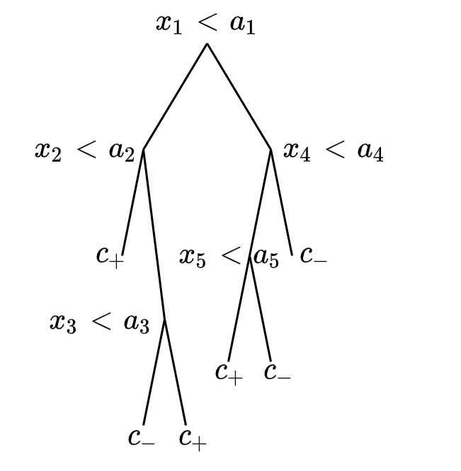

# Disjunctive Normal Networks
Disjunctive Normal Network (DNNs) is a special type of Neural Network used for binary classification. It uses intersected of convex polytopes that cover the feature space of samples belonging the positive class. In 2D it can be seen as multiple convex polygons spread on the plane enclosing all positive samples while leaving negative samples outside. 

[https://arxiv.org/pdf/1412.8534.pdf](https://arxiv.org/pdf/1412.8534.pdf)

# Motivation
The initial purpose of this project was an attempt to create a model with the simplicity and interpretability of Decision Trees combined with the differentiability and parameter tuning through backpropagation of Neural Networks.

Initial thoughts included representing the decision tree split function as a sigmoid, combining half-spaces to form a polytope and then combining multiple polytopes to form the decision function.

After searching through the literature it turned out that all of these concepts were present in multiple previous works, the most similar being the Disjunctive Normal Network paper.

# Model
A Decision Tree segments the space in hypercubes by drawing axis-aligned lines in the feature space. These hyperboxes enclose the points to form the decision function of the tree

The interior of the hypercubes enclosing the positive samples can be seen as the sub-space where a boolean function becomes True (1) and ouside is False (0).

For the tree of the top left picture the associated boolean function (1 for positive class , 0 for class ) is

This boolean function is written in [Disjunctive normal form](https://en.wikipedia.org/wiki/Disjunctive_normal_form) meaning that it is a union of intersections or an OR of ANDs (in terms of logic gates).

A DNN expresses such a boolean function in Disjunctive normal form. The main advantages of a DNN over a decision tree are
- Instead of hyercubes it uses polytopes which are high-dimensional polygons
- Is trained with backpropagation and can be thus incorporated in any neural netowrk topology as final or intermediate step
- Is less prone to overfitting (although this is a quick result shown by only some simple experiments)

# Experiments
